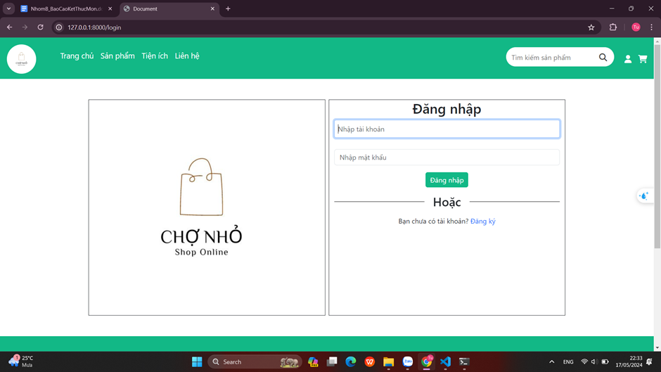
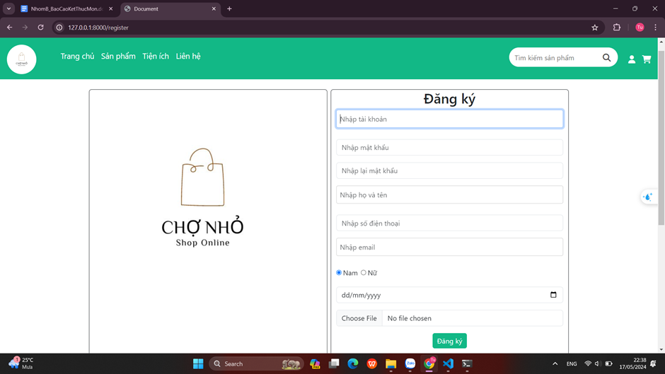
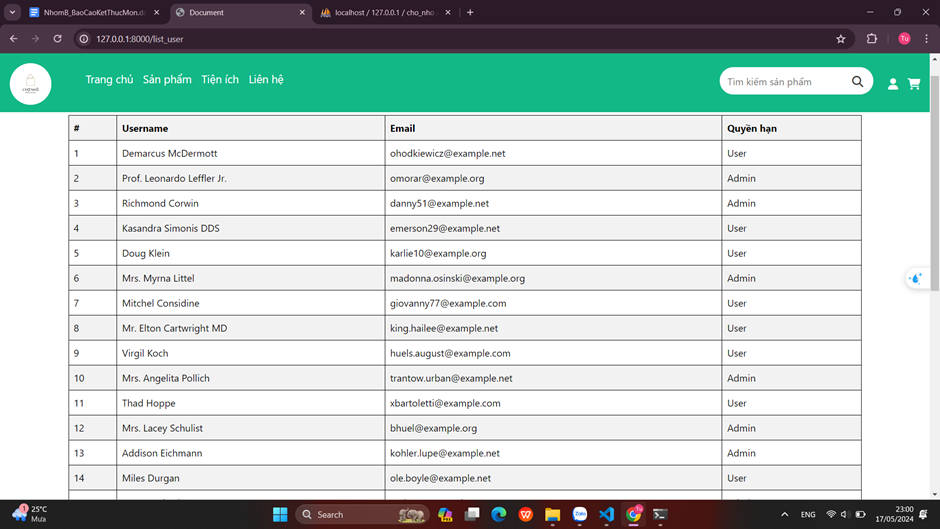
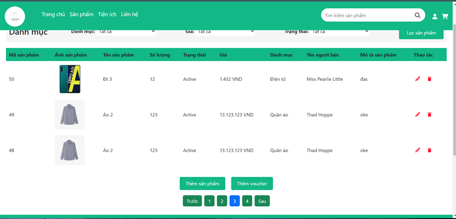
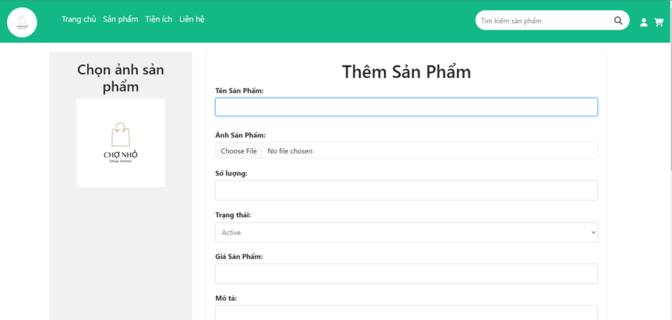
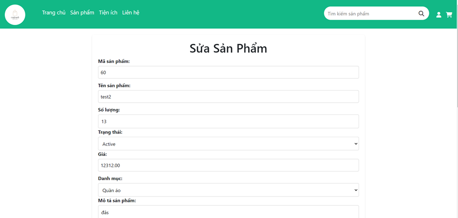
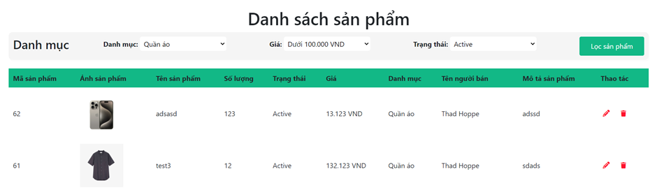
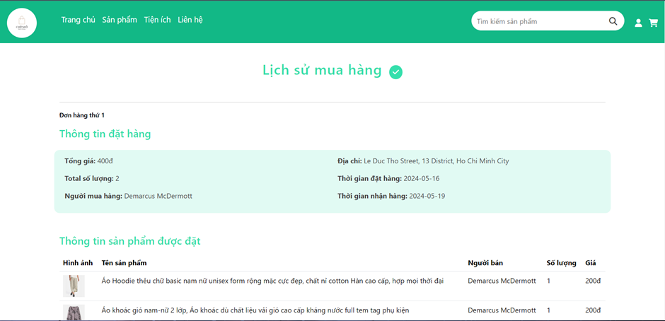
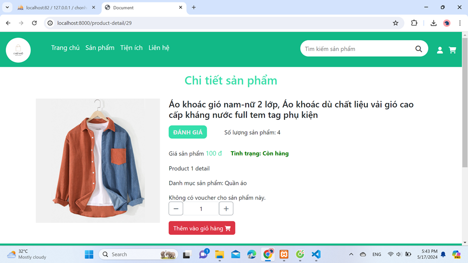
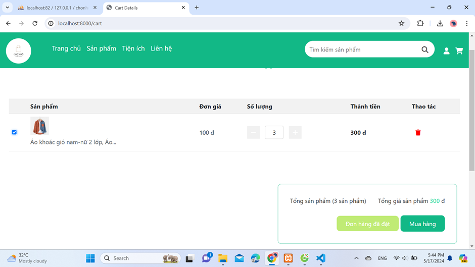

# E-commerce
<h2 align="center">Hi 👋, I'm Tuan</h2>

> ✍ I'm a student at the Thu Duc College of Technology [TDC - THU DUC COLLEGE OF TECHNOLOGY](https://el.tdc.edu.vn/).

 

## 📫 How to reach me:

   
   
  

## Skills:

  
  
  
  
  
  
  

## Introduce the project:

Dự án của tôi là tạo ra một ứng dụng web thương mại điện tử cho phép người dùng mua và bán sản phẩm dựa trên nhu cầu cá nhân của họ.

## Features:
- Mua và bán sản phẩm
- Đặt đơn hàng vào giỏ hàng và lưu vào lịch sử
- Đăng ký và đăng nhập tài khoản
- Quản lý sản phẩm của bản thân

## Installation guide:

Bạn cần phải có <a href="https://git-scm.com/">Git</a> để có thể pull source code từ repository về. Bạn có thể tải Git từ trang web chính thức của Git và làm theo hướng dẫn để cài đặt cho hệ điều hành của bạn.

Bạn cũng cần cài đặt <a href="https://getcomposer.org/">Composer</a> để quản lý các phụ thuộc PHP trong dự án. Composer là công cụ quan trọng để cài đặt Laravel. Bạn có thể tải Composer từ trang web chính thức và cài đặt theo hướng dẫn trên trang đó.

Clone source code từ repository:
Sau khi cài đặt Git, bạn có thể clone source code của dự án từ repository. Mở Terminal hoặc Command Prompt và di chuyển đến thư mục nơi bạn muốn lưu trữ dự án. Sau đó, chạy lệnh git clone <link-repository> để clone source code từ repository về. Thay <link-repository> bằng đường dẫn đến repository của dự án Laravel.

Di chuyển vào thư mục dự án Laravel đã được clone bằng lệnh cd <tên-dự-án>. Tiếp theo, chạy lệnh composer install để cài đặt các phụ thuộc của Laravel. Composer sẽ tải xuống và cài đặt tất cả các gói phụ thuộc được liệt kê trong tệp composer.json và tạo ra thư mục vendor chứa các thư viện cần thiết.

Sao chép tệp .env.example và đổi tên thành .env. Sau đó, bạn cần tạo khóa ứng dụng bằng lệnh php artisan key:generate.

Cuối cùng, chạy lệnh php artisan serve để chạy máy chủ phát triển tích hợp sẵn của Laravel. Mở trình duyệt và truy cập vào http://localhost:8000 để kiểm tra xem Laravel đã được cài đặt thành công hay chưa.

## User guide:

Mua và bán sản phẩm: Bạn có thể tìm sản phẩm bạn muốn mua bằng cách sử dụng chức năng tìm kiếm hoặc duyệt qua các danh mục sản phẩm. Khi bạn tìm thấy một sản phẩm, bạn có thể thêm vào giỏ hàng và tiến hành thanh toán.

Đặt đơn hàng và lịch sử: Khi bạn đã chọn sản phẩm và thêm vào giỏ hàng, hãy kiểm tra lại thông tin và tiến hành đặt đơn hàng. Sau khi đặt hàng thành công, bạn có thể xem lịch sử đơn hàng của mình để theo dõi tình trạng và chi tiết đơn hàng trước đây.

Đăng ký và đăng nhập: Nếu bạn muốn tận dụng các tính năng và quyền lợi của ứng dụng, hãy đăng ký tài khoản mới bằng cách cung cấp thông tin cần thiết. Sau khi đăng ký thành công, bạn có thể đăng nhập vào tài khoản của mình để quản lý và truy cập các chức năng riêng.

Quản lý sản phẩm: Nếu bạn là người bán hàng, bạn có thể tạo và quản lý các sản phẩm của mình. Bạn có thể thêm, sửa đổi và xóa sản phẩm, cập nhật thông tin và giá cả.

## Project Demo:
- Đăng nhập:

- Đăng ký:

- Danh sách User:

- Quản Lý sản phẩm:

- Thêm sản phẩm:

- Sửa sản phẩm:

- Danh mục sản phẩm:

- Lich sử mua hàng:

- Chi tiết sản phẩm:

- Mua sản phẩm:

